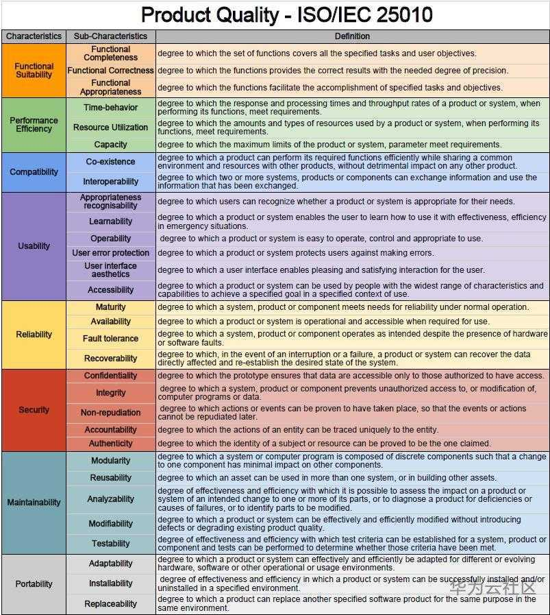
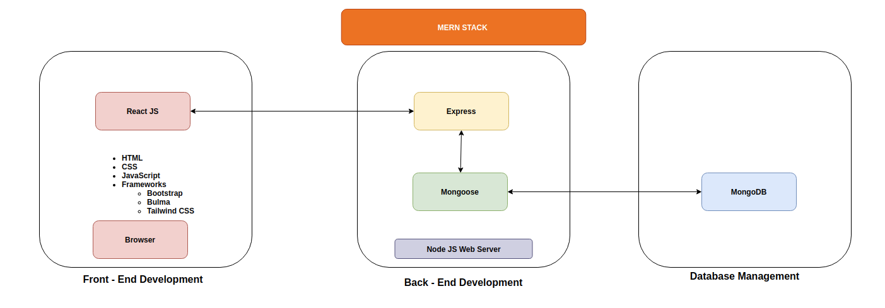

## Question 1
<!-- Provide an overview and description of a standard source control process for a large project -->
<!-- Provides an extensive overview and description of a standard source control process -->

Source control orl Version control is the process of recording, tracking, maintaining and controlling a series of changes generated by partial improvements to the same product or system in order to meet different requirements.

By understanding how the Source Control flow works on the large project. There are the example here.

1. The project manager will create the main project repository on the service after the basic rule of the source control been established by the leader or the project manager, which will start with the skeleton structure of the project, and this main branch will be the univesal version of this project and product that will become customers in the future. 

2. The project manager divides the project into parts as needed and assigns them to different teams, each of which is responsible for only one part of the project. The team leader will further break down the task and break down the task to each developer. An admin or team of admins will handle how the team modifies the main branch.

3. After all work has been assigned, each developer will copy or clone the repository code to their local machine, so they can do their work locally instead of the main branch, which will give developers enough freedom to additions or modifications, and the integrity of the source code are preserved.

4. Once the developer finish their part, they can submit their change to the main branch and create an pull request.

5. The admin team will review the changes and make sure they don't influence other features. Then they can commit the changes and merge to the main branch. Otherwise they will reject the changes and tell the developer to check the code until there is no influence to merge.

6. After the main branch has been updated, all the developer should get the pull from the main branch to get the newset version, to make sure their work is on the correct track.

7. Repeate step 4-7 until the project is finished.

1. https://www.atlassian.com/git/tutorials/comparing-workflows/feature-branch-workflow
2. https://aws.amazon.com/devops/source-control/

## Qustion 2
<!-- What are the most important aspects of quality software? -->
<!-- List discuss and demonstrate 6 software quality characteristics.
Shows almost flawless understanding of the high level structure of the app -->

Like other products, software products have quality requirements. Software quality is related to the degree of useage and service life of the software. A high-quality software is more popular with users. In addition to meeting the explicit needs of customers, it often also meets customer implicit needs, like the product interface is more beautiful and the user operation is simpler.

Software quality is a concern of both users and developers, but it is not easy to evaluate the quality of a software product comprehensively and objectively. The most common practice is to evaluate the quality of a piece of software according to the ISO/IEC 25010: 2011. It not only defines software quality, but also establishes a normative process for software testing, including the writing of test plans and the design of test cases. he product quality model defined in ISO/IEC 25010 comprises the eight quality characteristics, which are:

- Functional suitablity
    The functions realized by the software reach the degree of its design specifications and meet the needs of users, emphasizing correctness, completeness, suitability, etc. It involoves Functional completeness, functional correctness and functinal appropriateness.

- Efficiency
    Under certain conditions, the time characteristics of the software (such as response speed) and the degree to which a function can effectively utilize computer resources (including memory size, CPU usage time, etc.), and high local resource occupancy are usually performance bottlenecks. ; The number of concurrent users and connections that the system can sustain depends on the scalability of the system. It concerns Time-behavior, resource utilization and capacity.

- Compatibility
    Coexistence and interoperability, coexistence requires software to be compatible with system platforms, subsystems, third-party software, etc., and appropriate processing for internationalization and localization. Interoperability requires effective interface between system functions, involving APIs and file formats, etc. It concerns co-existence and inteoperability.

- Usability
    For a software, the degree to which the user learns, operates, prepares the input and understands the output, such as being simple and convenient to install, easy to use, user-friendly, and suitable for users with different characteristics, including the disabled and the handicapped. Effective ways or means of product use. It concerns appropriateness recognisability, learnability, operability, user error protection, user interface aesthetics and accessibility.

- Reliability
    The probability that the software can maintain its normal functional operation and performance level under the specified time and conditions, such as the higher the maturity, the higher the reliability; MTTF (mean time to failure) or MTBF (mean time Between failures,  to measure reliability. It concerns maturity, availability, Fault tolerance and recoverability.

- Security
    It is required to ensure its security in terms of data transmission and storage, including user identity authentication, data encryption and integrity verification, all key operations have records (log), and can review the actions of different user roles. It concerns confidentiality, integrity, non-repudiation, verifiability and authenticity.

- Maintainability
    When a software is put into operation, the requirements change, the environment changes, or the software fails, the degree of effort to make corresponding changes. It modularity, reusability, analyzability, modifiability and testability.

- Portability
    The ease with which software can be ported from one computer system or environment to another, or how easily a system can work with external conditions. It involves adaptability, installability and replaceability.



1. https://www.perforce.com/blog/qac/what-is-iso-25010
2. https://www.silasreinagel.com/blog/2016/11/15/the-seven-aspects-of-software-quality/
3. https://www.softwaretestinghelp.com/what-are-the-quality-attributes/

## Question 3
<!-- Outline a standard high level structure for a MERN stack application and explain the components -->

MERN stands for MongoDB, Express, React and Node.js, The amalgamation of these technologies is called MERN stack. By use MERN stack, the developer could create whole websites(back-end, front-end and database). Deverloper could easily build the website by only use Javascript.
- MongoDB - document-oriented NoSQL database
- Express.js - Node.js web application framework
- React.js   - JavaScript library for building user interfaces
- Node.js - Platforms server environment


From this image, we could easily separated the web application development into three tiers, which is Font-end, Back-end and database.
### Font-end - React.js
In MERN stack, React.js is used for the top tier Font-end, this tier will show basiclly everthing that user could see. React.js is a JavaScript framwork that use to create dynamic clientside application in HTML. React.js allows developers to build up complex interface by use simple components, and connect to the back-end servers get data from back-end, render to HTML. React.js have great support for events, errors, lists, forms and others. This make developer write their code faster and use less code.

### Back-end - Express.js and Node.js
In MERN stack, Express.js and Node.js used for the back-end or service side. 
Node.js is a JavaScript runtime environment, used to execute JavaScript code outside of the browser. it can run on most of the platforms like windows, Mac OS, Linux, etc. Node.js use event-driven, non-blocking I/O model, because of that node.js is really good to use for for data-intensive real-time applications that run across different devices. 
Express.js is web application framework for Node.js. it not just simplifies the development, but also make the code writing more secure, modelar and faster.

### Database - MongoDB
In MERN stack, MongoDB handle our database. MongoDB is a non-relational, document-oriented database. MongoDB is really powerful in MERN because the way it sotre data in JSON documents alongside dynamic schemas. This work in tandem with the front end, any JSON file creadted in React.js can be sen through the Express.js server, could send to MongoDB directly.

1. https://www.geeksforgeeks.org/mern-stack/
2. https://www.mongodb.com/mern-stack
3. https://www.bocasay.com/what-is-the-mern-stack/
4. https://www.w3schools.com/nodejs/nodejs_intro.asp

## Question 4
<!-- A team is about to engage in a project, developing a website for a small business. What knowledge and skills would they need in order to develop the project? -->

When developing a website for a small business, the development team should consider following skills and knowledge of the team members:
- Communication Skills
When a team want work as a team, Communication skill is really important. And the communication skills should have effective communication skills both internal and external. Internal communication skills help teams communicate with each other effectively and collaboration. External communication skills help team communication with the client or the supplier, this help team understand the client need and get help or avoid some problems.

- Product Management
Improving the user experience, understanding the user needs and creating actual product have the same weight. The website team build is a product after all. So making the customer feels it is worth the price is very important. By use product manangement skills, product manager have to deeply dig the business need and get to know the clinet's version, and pass them to the team.

- Design
A good design skills help the team give the beeter user interface and user experience. No one would like the ungly website, or bad user experience. So team should have the design skill to make the UI looks better and UX feels better.

- Accessibility for different platforms
The website should be able to work well on different platforms, like mobile, browser, tablet or other platforms. So this will require the developer need have the knowledge for these platform. And test team should consire the accessibility as will

- Security
The security of the client data and the security of the servers is protect our client privacy. There will always be some risk on iternet, ,inimizing that risk is what’s the team should do.

- Tech Stack
There are multiple technology stacks that could be used to build a website for example: MERN stack. Basic on the requirements of client or the requirements of the product team could choise the suitable tec stack. The following knowledge is used on the basic website development:
  - HTML
  - CSS.
  - Version-control like Git
    Version-control system is really important for the team. To makesure all the deverloper work on their job.
  - Database
    Retrieve, create, read, edit, update and delete data in database. 

1. https://ascendle.com/ideas/14-skills-your-app-development-team-must-have/

## Question 5
<!-- With reference to one of your own projects, discuss what knowledge or skills were required to complete your project, and to overcome challenges -->

One of the my own projects is develop a two side marketplace application by use ruby. Here is hte repository for [Tiny game store](https://github.com/sam-lee-py/T2A2_APP), this is my first ever full stack application build myself. The following knowledge or skills are used when I built it.

Because "Tiny game store" is basicly an website application. So the basic knowlege that for the website is required:
- HTML
- CSS AND SCSS

This application use rails as the framework. so the following skill if required for uses rails:
- Ruby, rails is base on ruby language. So ruby is required.
- Ruby on rails, Ruby on rails been used all the develop time.
- PostgreSQL Database, rails application require a database. I choise PostgreSQL as the main database for "Tiny game store".
- MVC Architecture pattern, Rails base on the MVC Architecture pattern, we cant write a good rails code without the knowledge of the MVC.
- Routing, By understanding the 'GET', 'POST', 'PUT' and 'DELETE' these CURD operations, we could use the right way to direct my webpage.

Becasue there are several features are already existing we can use 'GEMS' to easily use them instead write by yourself. When I work with the "Tiny game store", I found these gems are really useful.
- Devise, everyone need an account, use Devise is easy to create the authentication like login, sign in and other things.
- Stripe, This is my the first ever payment system. 
- Webhook, Ultralhook used to listening the response from the stripte.

By use the stripe and webhook I am try to build a simple payment system, and because stripe use Jquery and JavaScript like build session.
- JavaScript
- JSON

And some other technologies used when I build the application:
- Git and Github, helps to watching the changes and version control. Because this time only me work on this applicaiton, not much pull and branches issue.
- Heroku, to publish the application.
- Amazon S3, to storage the image files for the application
- Trello, project management make sure it will finish on time.
- Balsamiq, Balsamiq for the Wireframes design.
- Lucidchart, Lucidchart for the ERD

## Question 6
<!-- With reference to one of your own projects, evaluate how effective your knowledge and skills were for this project, and suggest changes or improvements for future projects of a similar nature. -->

In question 5, I explain the skills and knowledge to implement and use in developing "Tiny Game Store". 

This is the first time for me to use a 'framework' to develop an website, there are so many blocks and chanllenge during these time. But lucy we got a lot of the useful knowledege from the class, this give me more confidence to doing this project. For example, I learned the MVC architecture, this will let me much easily to read the code, and understand how the architecture works. And the "rails magic" allows me use less code to do more things.
I ddefinitely need to increase the knowledge of use 'framework', some of the file in the applicaiton, I never touched, so next step i need to learn more about how to work with the framework.

About the design, I always start with a really big dream, all the design is unrealistic. This make me restart the project several times, especially the ERD, database require precise definition, everytime when i try to restart, ERD will be one of the big block for me. So I need the cleary design for the whole project or website and staic on the plan.

The next challenges for me is try to find out the correct way to achieve goals, Spend a lot of time to search and check. For example, I try to do a payment system then i fount Stripe. Then I find out stripe need "session" to pass the parameters, and it is the JavaScript logic. This push me to search and find out more programming knowledge. For the future improvements the search skill and learning speed is need to be improved.

For the source control. Through this project I know how important it is, it's give you the freedom and safety feeling to do whatever you want, instead worried future. Like when i create one of the model is totally fail and i dont know where is the problem is. I could easily go back to check which lane is changed and easily find out the problem. Git skill need to improve.

By use Heroku and Amazon S3, this make the website visible online. Even it's give me a lot of problem like hard to clear the DB in service side. 

## Question 7
<!-- Explain control flow, using an example from the JavaScript programming language -->
<!-- Provides a thorough explanation of control flow in programming -->
Control flow is the order or sequence of execution in a programming language. Like other programming languages, control flow is an integral part of JavaScript, and it relies heavily on control flow to take actions based on situations or conditions.

### Conditionals
When you need to performance different actions based on different conditions, you will need the conditional statements. in JS we have IF ELSE and switch conditional statements
#### if/ if else/ if else if else
If else statement is simple, when the condition after if is true, then the code in `{}` will be executed, if the conditional is false then the code after if will be pass, then the code after else will be executed. For example:

- if
``` javascript
const a = 2;
if (a > 0) {
    console.log('a is bigger than 0');
}

if (a < 0) {
    console.log('a is smaller than 0');
}

// result: a is bigger than 0
```
In this example the first condition `(a > 0)` is true, so the code in `{console.log('a is bigger than 0');}` will be executed, but the second condition `(a < 0)` is false, so the code in `{console.log('a is smaller than 0');}` will be passed. so the result is `a is bigger than 0`.

- if else
``` javascript
const a = 2;
const b = 3;

if (a > b) {
    console.log('a > b is true')
} else {
    console.log('a > b is false')
}
//result:  a > b is false
```
Because the `(a > b)` condition is false so the code `{ console.log('a > b is true') }` will be passed and the code after `else` `{console.log('a > b is false')}` will be executed. So the result will be `a > b is false`

- if else if else
``` javascript
const a = 2;
const b = 3;
const c = 4;

if (a > b) {
    console.log('a > b')
} else if (b > c) {
    console.log('b > c')
} else {
    console.log ('none of them is right')
}
//result: none of them is right
```
In this example the condition `(a > b)` is false so move to the `else if `check the condition `(b > c)` , this conditon false as well, so move to the `else`, the code `{console.log ('none of them is right')}`  will be executed. So the result is `none of them is right`.

### switch
Switch statement works with conditional aswell, but unlike the if else statement, switch statement take in an expression  and evaluates it once. If any of the preceding cases match the expression, then the code in that expression will be excuted.

``` javascript
const day = new Date().getDay();

switch (day)) {
  case 1:
    console.log('Today is Monday.');
    break;
  case 2:
    console.log('Today is Tuesday.');
    break;
  case 3:
    console.log('Today is Wednesday.');
    break;
  case 4:
    console.log('Today is Thursday.');
    break;
  case 5:
    console.log('Today is Friday.');
    break;
  default:
    text = "It's Weekend.";
}
```

In this example, the `day` will give a number from 0 to 6, means Sunday to Saturday. Switch statement take expression `day`, for example the today is monday so the day will be 1, then match the second case, then excute the code after the second case. Until meet the `break` jump out from the switch statement or finish this switch statement.

### loop
A loop statement is an iteration statement, it will keep running until the condition fails or nothing is left to loop.
in JS we have for loop and while loop.

### for loop
The for loop statement will have an conditional, the loop will keep executing until the condition is false.

``` javascript
const pets = ['dog','cat','fish'];

for (let i = 0 ; i < pets.length ; i++) {
  console.log('My pet is ' + pets[i]);
}>)

// My pet is dog
// My pet is cat
// My pet is fish
```
In this example, we set the `i = 0` first, then check the condition `i < pets.length` is true, so the loop will run then we print the `my pet is dog`. After the code in the block excuted, `i++` excuted. then we check the condition again. This will keep run until the condition `i < pets.length` is false.

The two special way to use the for loop is for/in and for/of. Normally they used with the object or array. 
for/in is loop the properties of an object (keys).
for/of is loops the values of an iterable object (values).
They will running to the end of the object or array.
for example:
``` javascript
const peoples = { name: 'Alex', nickname: 'Big rock', age: 18}
let keys = [];
let values = [];

for (let key in peoples) {
  keys.push(key);
}
console.log(keys);

// ['name', 'nickname', 'age']

for (let value of peoples) {
  values.push(value);
}
console.log(values);

// ['Alex','Big rock', 18]
```

### while loop
While loop is really similar to the for loop, the loop will keep run until the contional is false.

``` javascript
const pets = ['dog','cat','fish'];

while (pets.length > 0) {
  const pet = pets.pop();
  console.log('My pet is ' + pet);
})

// My pet is fish
// My pet is cat
// My pet is dog
```
In this example, we can see that the while loop is really like the for loop, each time in the loop will pop out one of the element. The loop will keep running until the `pets.length > 0` false.

``` javascript
const pets = ['dog','cat','fish'];

do {
  const pet = pets.pop();
  console.log('My pet is ' + pet);
}) while (pets.length <= 0);

// My pet is fish
// My pet is cat
// My pet is dog
```
do/while loop is same with the while. only different is the code will run once then check the condition, if the condition is true, keep looping, if the condition is false, break the loop. for example:

### break
Break could jump out from the loop, without check the condition.
for example:
``` javascript
for( let i = 0; i < 3 ; i++ ) {
  if ( i == 1 ) { break; }
  console.log( i );
}

// 0
```
When the `i == 1` we meet the `break`, it will jump out from the for loop.

### continue
Continue breaks one iteration then continue the next iteration.
``` javascript
for( let i = 0; i < 3 ; i++ ) {
  if ( i == 1 ) { continue; }
  console.log( i );
}

// 0
// 2
```
When the `i == 1` we meet the `countinue`, the code after continue is not executed, then go to next iteration `i = 2`. 


### Callbacks

### Error handling

1. https://medium.com/@rianna.cleary/control-flow-in-javascript-9c63d0c98bb9#:~:text=Control%20flow%20in%20JavaScript%20is,loops%2C%20conditionals%2C%20or%20functions.
2. https://www.jetbrains.com/help/youtrack/devportal/Quick-Start-Guide-Workflows-JS.html#workflow-permissions
3. https://learn.co/lessons/javascript-intro-to-flow-control
4. https://dev.to/mugas/control-flow-in-javascript-246l


## Question 8.
<!-- Explain type coercion, using examples from the JavaScript programming language -->

Type coercion is one kind of process that could convert one type of value to another type.
In javascript there are three type of the conversion. 
- to string.
- to number.
- to boolean.

Type coercion could be Implicit or Explicit. 
Implicit type coercion or type casting means the developer convert type of value by writing the appropriate code.
For example:
``` javascript
console.log(typeof Number("888")); // 888 => 'number'
console.log(typeof String(12345)); // '12345' => 'string'
console.log(typeof Boolean(0)); // false => 'boolean'
```
Explicit type coercion means in some situaction the type of value could change automatically, it's normally happens when apply operators to values of different types.
``` javascript
const x = 4 / '5'; 
console.log(x); // 0.8
console.log(typeof x); // 'number'
// String '5' convert to number 5, without use Number('5').

console.log('Hi.' + 5); // 'Hi. 5'
// Number 5 convert to string '5'.

let zero = 0 ? true: false;
console.log(let); // false
// Number 0 convert to boolean false.
```

There are only have 6 false values in JavaScript.
``` javascript
console.log(Boolean(''));          // false
console.log(Boolean(0));           // false Boolean(-0) is false as well
console.log(Boolean(NaN));         // false
console.log(Boolean(null));        // false
console.log(Boolean(undefined));   // false
console.log(Boolean(false));       // false
```
All the other value that not belong to these 6 will converted to true, including object, function, array etc.
``` javascript
console.log(Boolean({});            // true
console.log(Boolean([]));           // true
console.log(Boolean(function() {}));// true
```

There are some special cases:
- `==` and `!=` will only check the value but not the type, JS will try to convert the type and compair them.
- `===` and `!==` check both value and type.
- when `null` or `undefined` on the side of the `==`, they not convert `null` or `undefined` to number. `null` only equals to `null` or `undefined`.
- `NaN` does not equal to anything even it self.
``` javascript
console.log(5 == '5');              // true
console.log(5 === '5');             // false

console.log(Number(null));          // 0
console.log(null == 0);             // false
console.log(undefined == null);     // true

console.log(NaN == NaN);            // false
```

1. https://www.freecodecamp.org/news/js-type-coercion-explained-27ba3d9a2839/


## Question 9
<!-- Explain data types, using examples from the JavaScript programming language -->

The data type is how the computer stores data and how to treat them. In JavaScript, there are two categories of data types. They are Primitive data types and reference data types.

### Primitive data types

In JavaScript, Primitive data types are simple, they are not object dont have methods. The primitive data types are numbers, strings, booleans, null, and undefined. For the type that need to use methods JavaScript converts primitive type to object to make sure they can use methods. Like string to `String`.
#### Number: 
There are only one type of the number value in JavaScript, it's called number , Not like floot or integers in ruby.
``` javascript
console.log(typeof 888);               // 'number'
console.log(typeof -1);                // 'number'
console.log(typeof 0.1);               // 'number'
console.log(typeof 0);                 // 'number'
```
#### String:
We could use `""`, `''` or ` `` ` to create the string type of the data. But empety string `""` will return undefined.

We can still use the `+` or ` ${} ` to manipulat string. Whenever one side of the `+`, it will convert the other side to string.
``` javascript
console.log(typeof 'I love my dog.');  // 'string'
console.log("");  // undefined

let name = "Alex";
console.log(`Name is ${name}.`); // Name is Alex.

console.log(typeof (4 + '5')); 
// 4 will convert to '4' then join '4' and '5' to '45', and it's string type. Resule 'string'.
```


#### Boolean:
Boolean in JS have two values: true and false. It's normally  used to determine if an operation is true or false. There are 6 false values in JavaScript : `false`, `undefined`, `0` and `-0`, `NaN`, `null` , `""`. They will automatically convert to a false boolean value when the code need to check the conditional.

``` javascript
console.log(typeof true);              // 'boolean'
console.log(typeof false);             // 'boolean'

if ('') { 
  console.log(true);
} else {
  console.log(false);
}
// 'false'
```

#### Undefined:
The value is undefined when the variable has not been assigned or the method's or statement's variable does not have an assigned value or the function has no value returned.
``` javascript
console.log(typeof undefined);         // 'undefined'

let a;
console.log(a);                        // 'undefined'
```


#### Null:
`null` is primitive type. But `typeof null` will show it is object because typeof function return the object for null, we can use the flollower example.
``` javascript
console.log(typeof null);              // 'object'

// Example:
const countA = (string) => {
  const num = string.match(/[a]/gi);
  if (num === null){return 0;}
  return m.length;
}

console.log(countA('dog'));
// result 0 cos the 'dog'.match(/[a]/gi) === null.
```

### Reference data types
In JavaScript, reference data types are the types dynamic, have no fixed size, and are mostly treated as objects. It includes the data types like array, function and objects.

``` javascript
a = [1,2,3];
console.log(typeof a);                // 'array'

b = (x) => x = 1;
console.log(typeof b);                // 'function'

c = {name:'alex'};
console.log(typeof c);                // 'object'
```

Most of the reference data types in javascript have method. 
For example:
``` javascript
a = [1,2,3];                      // a is array
b = a.map((x) => x + 1);          //use map method
console.log(b)                    // [2,3,4]
console.log(b[0])                 // use index get the value 2.
```

1. https://codeburst.io/explaining-value-vs-reference-in-javascript-647a975e12a0#:~:text=Javascript%20has%203%20data%20types,Array%20%2C%20Function%20%2C%20and%20Object%20.
2. https://www.freecodecamp.org/news/primitive-vs-reference-data-types-in-javascript/
3. https://developer.mozilla.org/en-US/docs/Web/JavaScript/Reference/Global_Objects/undefined

## Question 10
<!-- Explain how arrays can be manipulated in JavaScript, using examples from the JavaScript programming language -->

Array in JavaScript is an object can store multiple elements. The element could be any type of data.
``` javascript
cost newArray = [
  0,                                      // number
  false,                                  // boolean
  [1, 2],                                 // array
  'string',                               // string
  {name: 'Alex'},                         // object
  function hi() {console.log('hello')}    // function
];
```

### Create an new array.
Array could be created by use `[]`. Another way to create an array is use `new Array()` beacuse array is an object in javascript.

``` javascript
const fruits = ['apple','banana','orange','pear'];
const numbers = new Array(1, 2, 3);
const emptyArray = [];

console.log(fruits);     // ['apple','banana','orange','pear']
console.log(numbers);    // [1, 2, 3]
console.log(emptyArray); // []
```

### Access elements
Because the array have the index, we could use the index to access the elements in the array. Index start from 0. For example:
``` javascript
const fruits = ['apple','banana','orange','pear'];
console.log(fruits[0]);
// 'apple'
```

### Add Element
Thtere are some way to add elements to the existing array. `push()` and `unshift()` are the build-in methods to add elements to array.
`push()` add element at the end of the array.
`unshift()` add element at the front of the array.
for example
``` javascript
let fruits = ['banana','orange'];

fruits = fruits.push('pear');
console.log(fruits);     
// ['banana','orange','pear']

fruits = fruits.unshift('apple');
console.log(fruits);     
// ['apple','banana','orange','pear']
```

We could also add element by accesing the index value.
``` javascript
let fruits = ['banana','orange'];

fruits[2] = ('pear');
console.log(fruits);     
// ['banana','orange','pear']

fruits[4] = unshift('apple');
console.log(fruits);     
// ['apple','banana','orange', undefine, 'pear']
// fruits[3] is undefined cos we didn't define the value of index 3.
```

### Change the elements
We could use the index to change the element value. But
``` javascript
let fruits = ['banana','orange'];

fruits[1] = ('apple');
console.log(fruits);     
// ['banana','apple']
// fruits[1] value is change to 'apple'
```

### Remove an element
We could use `pop()` and `shift()` menthod to remove the element and return the value. 
`pop()` remove element at the end of the array and return the value. .
`shift()` remove element at the front of the array and return the value.
for example
``` javascript
let fruits = ['apple','banana','orange','pear'];

firstFruit = fruits.shift();
console.log(firstFruit);      // 'apple'
console.log(fruits);   
// ['banana','orange','pear']

lastFruit = fruits.pop();
console.log(lastFruit);       // 'pear'
console.log(fruits);    
// ['banana','orange']
```

### `.length()`
This one will return the length of the array. Return value is number.
``` javascript
let fruits = ['apple','banana','orange','pear'];
console.log(fruits.length);  
// 4
```

### Array methods
### `.concat()`
`.concat()` will join the arrays together and return the result. It could be two or more arrays. for example:
``` javascript
let a = [1, 2, 3];
let b = ['a'];
let c = [4, 5, 6];
console.log(a.concat(b,c)); 
// [ 1, 2, 3, 'a', 4, 5, 6]
```

### `.indexOf()`
`.indexOf()` method search the value of the element and return the index. for example:
``` javascript
let fruits = ['apple','banana','orange','pear'];
console.log(fruits.indexOf('apple'));      
// 0
```

### `.find()`
`.find()` method searth the array from beginning and return the first value that match the given condition. for example:
``` javascript
let numbers = [1,3,10,6,2];
console.log(numbers.find(x => x > 5));      
// 10
```
### `.findIndex()`
`.findIndex()` method is really close to the `.find()` method but returns the index of the first value instead the value.
``` javascript
let numbers = [1,3,10,6,2];
console.log(numbers.findIndex(x => x > 5));      
// 2
```

### `.forEach()`
`.forEach()` method call a function to each of the elements. This method not change the original array and not return anything.
``` javascript
let a = [1, 2, 3];
console.log(a.forEach(o => o + 1)); 
// undefined  cos forEach not return anything.
let b = [];
a.forEach(o => b.push(o + 1));
console.log(b);
// [2, 3, 4]  forEach run function for every elements in Array a.
```

### `.map()`
`.map()` method is really like the `forEach()` method, but map will return an new array. for example:
``` javascript
let a = [1, 2, 3];
console.log(a.map(o => o + 1)); 
// [2, 3, 4]
```

### `.reduce()`
`.reduce()` methoed will run the callback function with the use passed first initial value for the first each elements in the array and return the value pass to the callback function as the new initial value for the next element until the end of the array. for example:
``` javascript
let a = [1, 2, 3];
let sum = a.reduce((sum , x) => sum + x, 0);
// 0 is the initial value, will pass to the callback function as sum 
// x will be the frist element of the array 1 
// the function will return `0+ 1` as the new initial value sum 
// and the second element `2` as x ...
// until the end of the array.
console.log(sum); 
// 6
```


### `.includes()`
`.includes()` method check the array contains element or not. This method will return an boolean value. for example:
``` javascript
let fruits = ['apple','banana','orange','pear'];
console.log(fruits.includes('apple'));   // true
console.log(fruits.includes('egg'));     // false
```

### `.sort()`
`.sort()` method will sort the elements alphabetically in strings and in ascending order
``` javascript
let fruits = ['pear', 'banana', 'apple', 'orange'];
console.log(fruits.sort());
// ['apple','banana','orange','pear']
```

### `.slice()`
`.slice()` method selects the part of an array and return the new array. The Syntax is slice() , slice(strat) and slice(start, end). All of the posion could use `-` count from right, `-1` is the last element.
For example:
``` javascript
let fruits = ['pear', 'banana', 'apple', 'orange'];
console.log(fruits.slice());      // return an new array
// ['pear', 'banana', 'apple', 'orange']
console.log(fruits.slice(1));     // start index 1.
// ['banana', 'apple', 'orange']
console.log(fruits.slice(1, 2));  // start index 1 end index 2
// ['banana', 'apple']
console.log(fruits.slice(-2));    // start from the second last element
// ['apple', 'orange']
console.log(fruits.slice(1, -2)); // start index end the second last element
// ['banana', 'apple']
```

1. https://www.programiz.com/javascript/array
2. https://developer.mozilla.org/en-US/docs/Web/JavaScript/Reference/Global_Objects/Array
3. https://javascript.info/array

## Question 11
<!-- Explain how objects can be manipulated in JavaScript, using examples from the JavaScript programming language -->

In JavaScript, Object is a kind of non-primitive data type, This data type will allow you to store multiple collections of data. The syntax to declare an object is `obj_name = { key: value , key: value , ...}`, each of the `key: value` pair(property) is one of the member separated by commas and all of the properties are enclosed in curly braces `{}`. For example:
``` javascript
const person = { firstName: 'Sam', age: 33 };
// obj_name = { key: value , key: value , ...}
```

If we want to access the property, we can use the key to access the value of the property. We can use dot notation or the bracket notation.
We can change the value of the property when we accessing by the key.
``` javascript
const person = { name: 'Sam', age: 33 };
console.log(person.name); // 'Sam'
console.log(person['age']); // 33

person.name = 'Alex'
console.log(person.name); // 'Alex'
```

Object can contains all kind of the properties, even another object or function.
When we want use the function stored in an object the parentheses `()` cannot be omitted, even there is no parameters. And we can use `this` to call the property whith in this object. This function could be called menthod of this object.
``` JavaScript
const person = { 
  name: 'Sam', 
  age: 33,
  address: {state: 'Vic', city: 'Mel'},
  sayHi: function() {console.log('Hello '+ this.name)}
};

console.log(person.address.state)  // 'Vic'
person.sayHi()                     // 'Hello Sam'
```

We can create the Object as the 'blueprint' (object constructor function) for create many other object with the same 'type'. For example:
``` javascript
function Student(name, id){
  this.name = name;
  this.id = id;
}
student1 = new Student('Sam', 1);
student2 = new Student('Yun', 2);
console.log(student1.id + '. ' + student1.name); // 1. Sam
console.log(student2.id + ' ' + student2.name);  // 2. Yun
```
If we want add new property or method to the created object we could use the following syntax ` objectName.newPropertyKey = newPropertyValue`. 
If we cant add new property or method to the object constructor function we could use the `prototype`, syntax is `FunctionName.prototype.newPropertyKey = newPropertyValue`. For example:
``` javascript
function Person = { 
  this.firstName  = firstName;
  this.lastName  = lastName;
}
sam = new Person('Sam', 'Li');
sam.age = 33;
console.log(sam.age)   // 33

Person.prototype.fullName = function(){
  return this.firstName + ' ' + this.lastName
} 
kha = new Person('Kha','Phan');
console.log(kha.fullName()) // Kha Phan
console.log(sam.fullNmae()) // Sam Li
```

### Method

### `Object.assign()`
`Object.assign()` method copy all the properties from one or more objects to target object. It will return the target object that been modified.
``` javascript
const obj1 = {x: 1, y: 2};
const obj2 = {y: 3, z: 4};
console.log(Object.assign(obj1,obj2)); // {x:1, y:3, z:4} 
```
In this example, the property `y` value been modified from the `obj2` to the target object `obj1`, so the value is `3`.

### `Object.entries()`
`Object.entries()` method returns an array , each of the element is the an array `[key, value] `.
``` javascript
const obj = { a: 'b', c: 1 };
console.log(Object.entries(obj));
// [ [ 'a', 'b' ], [ 'c', 1 ] ]
```

### `Object.keys()`
`Object.keys()` method returns an array of the property names.
``` javascript
const obj = { a: 'b', c: 1 };
console.log(Object.keys(obj));
// ['a', 'c']
```

### `Object.values()`
`Object.values()` method returns an array of the property value.
``` javascript
const obj = { a: 'b', c: 1 };
console.log(Object.values(obj));
// ['b', 1]
```

1. https://www.programiz.com/javascript/object
2. https://developer.mozilla.org/en-US/docs/Web/JavaScript/Reference/Global_Objects/Object

## Question 12
<!-- Explain how JSON can be manipulated in JavaScript, using examples from the JavaScript programming language -->

JavaScript Object Notation (JSON) is a syntax for serializing data, this data could be any data type. JSON is a kind of the data inerchange format and based on JavaScript syntax, but it is language independent. JSON format is text only, self-describing and easy to understand.

JSON Syntax Rules 
  - "Name" `:` "value" pairs
  - Separated by commas `,`
  - Object enclosed in Curly braces `[]`
  - Object enclosed in Square brackets `{}`

We can find out this syntax rule is really close to the javascript object syntax rule, so the javascript program can easily convert JSON to JavaScript object.
``` javascript
{"firstName":"Sam", "lastName":"Li", "address":{"state":"VIC", "city":"Mel"}, "array":["1","2"]}
// JSON file will look like this
```
### `JSON.parse()`
`JSON.parse()` method used to converting from JSON format string to JavaScript Object. For example:
``` javascript
const jsonText = '{"firstName":"Sam", "lastName":"Li", "address":{"state":"VIC", "city":"Mel"}, "array":["1","2"]}';
console.log(JSON.parse(jsonText));
// {firstName: 'Sam', lastName: 'Li', address: { state: 'VIC', city: 'Mel' }, array: [ '1', '2' ]}
```
### `JSON.stringify()`
`JSON.stringify()` method use to convert javascript object or value to JSON format string. For example:
``` javascript
console.log(JSON.stringify({ a: 1, b: 2 }));
// '{"a":1,"b":2}'
```

1. https://developer.mozilla.org/en-US/docs/Web/JavaScript/Reference/Global_Objects/JSON
2. https://www.digitalocean.com/community/tutorials/how-to-work-with-json-in-javascript
3. https://www.w3schools.com/js/js_json.asp

## Question 13
<!-- For the code snippet provided below, write comments for each line of code to explain its functionality. In your comments you must demonstrates your ability to recognise and identify functions, ranges and classes -->


``` javascript
// create class called `Car`
class Car { 
  // initializes objects by pass `brand` as the parameter when create new Car object.
  constructor(brand) { 
    // Use `this` as the object itself, create an variable called `carname` and assign this variable by the parameter 'brand'.
    this.carname = brand; 
  // finish initializes function
  }
  // Create a function (method) called `present`, Because `()` dont have any  parameters in it, so when we use this function we dont need pass any parameters into this funciton.
  present() { 
    // return an string gouped by 'I have a ' static part and `this.carname` variable by use `+`. Because we function buind in the object we can use `this` to call any variable or function in this object.
    return 'I have a ' + this.carname; 
  // close `present()` function
  }
// close class `Car` 
}

// Creat class called `Model` and it inherits from class `Car` which means all the variable and method from class `Car` will be inherited to class `Model`.
class Model extends Car {
  // initializes objects by pass `brand` and `mod` as the parameters when create new Model object
  constructor(brand, mod) {
    // The first parameter will be 'brand'.
    // Because class `Model` is inherited from class `Car` so it will inherits the constructor function from class `Car`.
    // By use the key word `super` we can call the parent constructor function and pass a parameter 'brand'.
    // So class `Model` have the variable called `carname` and assign the value as `brand`.
    super(brand);
    //  Create an variable called `model` and assign this variable by the parameter 'brand'.
    this.model = mod;
  // finish initializes function
  }
  // Create a function (method) called `show`
  show() {
     // Because class `Model` is inherited from class `Car`, so class `Car` inherits all the function(method) from his parent class `Model`. That mean the function `present()` is inherited.
     // By use `this` keyword to callback owned function `present()`, and get the return value.
     // Use  value `+` string `+` owned variable `model` value. Implicit converse all the values to an string value and retrun it.
     // The return value should be `"carname", it was made in "model"`
    return this.present() + ', it was made in ' + this.model;
  // close `show()` function 
  }
// close class `Model`
}

// Declare an new array called `makes` and assign the value as `["Ford", "Holden", "Toyota"]
// Because it used `let` keyword so array `makes` is block-scoped local variable, and it can be updated but not re-declared.
let makes = ["Ford", "Holden", "Toyota"] 

//  Use `new Array(40)` created an new array with the length is 40, and all the values is undefined.
//  Because this array is the first parameter of the `Array.from()` function, and we know the `Array.from()`function syntax is ` Array.from(array, (element, index) => {} )`. So `x` is the element of the first parameter array, and `i` is the index of the first parameter array. Each of the element is added with `1980` and his index, so the array should be [1980, 1981...2019].
// `Array.from` return an new array, so here we pass the result of `Array.from()` to an new variable called 'models'. 
let models = Array.from(new Array(40), (x,i) => i + 1980)

// Create a function called `randomIntFromInterval` and this function take at least two parameters. 
// The first parameter will be declared as name `min`, the second parameter will be declared as name `max`
function randomIntFromInterval(min,max) {
    // `Math.random()` will return a random number from 0 to 1 (inclusive of 0, but not 1).
    // Times `*` this value with `max-min+1` the value range will be `0` to `max-min+1`  (inclusive of 0, but not `max-min+1`)
    // Add `+` min so the range of the value will be `min` to `max+1` (inclusive of `min`, but not `max+1`)
    // `Math.floor()` will return the integer part of the value so the range will become form `min` to `max`(both inclusive), and the value is number only have the integer part.
    return Math.floor(Math.random()*(max-min+1)+min);

// close function `randomIntFromInterval`
}

// Start a for loop. Because the `models` is an array and use the `for...of`, So it will loop every element of array `models`, and each time of the element will been assign by an element of the array from start to end.
for (model of models) {

  // Declare an variable called `make` and assigned by one of the element of array `makes`, the value in the `[]` will take a number value as the index of the array. The index is the result of function `randomIntFromInterval()` and pass the first parameter as 0, second parameter as `makes.length-1`.
  // `array.length()` will return the length of the array, because the index of array start from 0 not 1 , so the reasonable index will be from 0 to `makes.length-1`.
  // `randomIntFromInterval` will return a random number between 0 and `makes.length-1`, as the index of the array `makes`.
  make = makes[randomIntFromInterval(0,makes.length-1)]


  // Declare an variable called `model` and assigned by one of the element of array `models`, the index will be the random number between 0 and `models.length-1`
  model = models[randomIntFromInterval(0,models.length-1)]

  // Create an new class object `mycar` by use class `Model` and pass two parameters, first parameter will be variable `make`, second variable `model`. By use this two parameters we can initializes `mycar`, so `mycar.brand = make(first prameter)` and `mycar.model = model(second prameter)`.
  mycar = new Model(make, model);
  // callback the function '.show()` from object `mycar`. The result will be `make, it was made in model`. Pass this string result to the WebAPI funciton `console.log()`. 
  // `console.log()` function print the result to the screen or the console
  console.log(mycar.show())
}
```